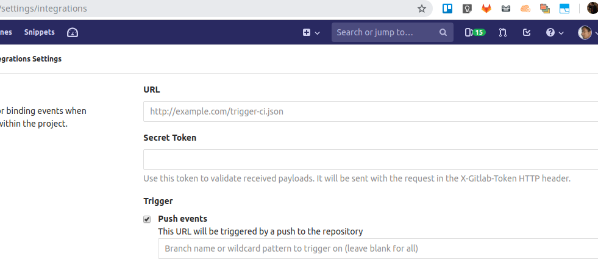

# webhook-lambda
Easily create a webhook on AWS. Use it to launch a CodePipeline pipeline or customise the serverless function as you see fit.

## Instructions
There are 3 required parameters:
1. Pipeline name. This is the CodePipeline pipeline name to trigger.
2. Header name. This is the header that is sent by the provider to identify themselves.
3. Token. This is a secret token that you can enter on the provider side to validate that it's actually being sent from them.

Command format:

`aws cloudformation deploy --template-file templates/template.yaml --stack-name STACK_NAME --parameters ...`

## Gitlab Example
Go to Settings > Integrations.

1. Deploy this stack.
2. Choose a secret token.
3. Enter the Api Gateway url in the stack output and the secret token on the gitlab page shown.
